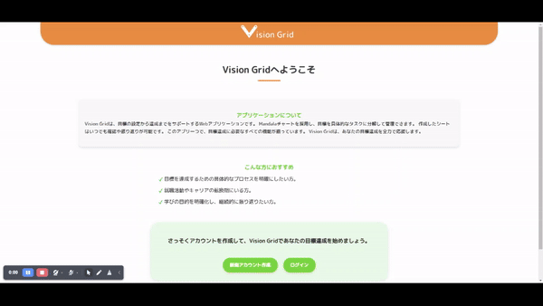
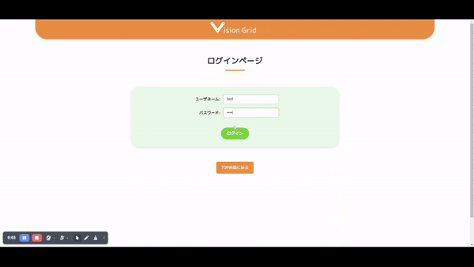
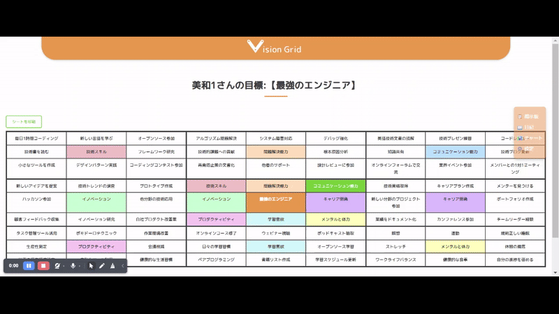

<div align="center">
   <picture>
      <source media="(prefers-color-scheme: dark)" srcset="https://github.com/Mmmmjp/Vision_grid/blob/main/images/readme_header_logo.png">
      
   </picture>
</div>
<!--     -->
<!-- base64 flags are available at https://www.phoca.cz/cssflags/ -->
<div align="center">
 <a href="https://github.com/Mmmmjp/Vision_grid/blob/main/README.md">
    

 <a href="https://github.com/Mmmmjp/Vision_grid/blob/main/.github/README_en.md">
    
</a>
</div>

# 📋🚀Vision Grid - 目標設定・達成サポートアプリケーション

【目次】
- [🌐アプリケーションについて](https://github.com/Mmmmjp/Vision_grid?tab=readme-ov-file#%E6%A6%82%E8%A6%81)
- [🎯ターゲットユーザー](https://github.com/Mmmmjp/Vision_grid#%E3%82%BF%E3%83%BC%E3%82%B2%E3%83%83%E3%83%88%E3%83%A6%E3%83%BC%E3%82%B6%E3%83%BC)
- [💡アプリケーションの作成動機](https://github.com/Mmmmjp/Vision_grid#%E3%81%AA%E3%81%9Cvisiongrid%E3%82%92%E4%BD%9C%E6%88%90%E3%81%97%E3%81%9F%E3%81%AE%E3%81%8B%E4%BD%9C%E6%88%90%E5%8B%95%E6%A9%9F)
- [🛠️アプリケーションの機能](https://github.com/Mmmmjp/Vision_grid#%E3%82%A2%E3%83%97%E3%83%AA%E3%82%B1%E3%83%BC%E3%82%B7%E3%83%A7%E3%83%B3%E6%A9%9F%E8%83%BD)
- [🌱アプリケーション開発を通しての学習目標](https://github.com/Mmmmjp/Vision_grid#%E3%82%A2%E3%83%97%E3%83%AA%E3%82%B1%E3%83%BC%E3%82%B7%E3%83%A7%E3%83%B3%E9%96%8B%E7%99%BA%E3%82%92%E9%80%9A%E3%81%97%E3%81%A6%E3%81%AE%E5%AD%A6%E7%BF%92%E7%9B%AE%E6%A8%99)
- [💻使用技術](https://github.com/Mmmmjp/Vision_grid#%E4%BD%BF%E7%94%A8%E6%8A%80%E8%A1%93)
- [📂レポジトリクローンに関して](https://github.com/Mmmmjp/Vision_grid#clone)
- [🗄️データベースに関して](https://github.com/Mmmmjp/Vision_grid#%E3%83%87%E3%83%BC%E3%82%BF%E3%83%99%E3%83%BC%E3%82%B9)
- [🗂️ディレクトリ構図](https://github.com/Mmmmjp/Vision_grid#directory-tree)
  
--- 
## 🌐アプリケーションについて
**VisionGrid**は、目標設定と達成をサポートするためのWebアプリケーションです。  
Mandalaチャートを採用し、ユーザーが大きな目標を具体的な要素とタスクに分解し、それを管理・振り返りながら達成を目指す仕組みを提供します。

▶【Mandalaチャートサンプル画像】


---
## 🎯ターゲットユーザー
- 目標に向かって努力している方、新しいことを学んでいる方。
- 就職活動やキャリアの転換期にあり、自分自身と向き合う必要がある方。

---

## 💡なぜVisionGridを作成したのか？[作成動機]

### 💬 解決したい課題

このアプリは、以下の課題を解決するために作成されました：

#### ▶　学びの目的の明確化
- 未経験からエンジニアを目指す中で、目標や進むべき方向が不明確になることがありました。
- これがモチベーションの低下につながるため、目標設定や振り返りを手助けする仕組みが必要でした。

#### ▶　紙ベースのMandalaチャートの限界
- 紙では進捗管理が難しい。
- 修正や変更が手間で柔軟性に欠ける。
- 記録を振り返るのが面倒。

### 💡 WEBアプリケーションによる解決策

| 課題                           | 解決策                              　　　　　　　　　　　　|
|--------------------------------|----------------------------------------------------------|
| **情報量を柔軟に管理**         | 補足情報を入力できる機能を追加し、紙のマス目の制限を克服。      |
| **振り返りの効率化**           | 日記やレポート機能を導入し、過去の目標や進捗を簡単に確認可能。  |
| **進捗管理の手軽さ**           | 編集可能なMandalaチャートを実装し、目標の更新をスムーズに。    |
| **データの共有と安全性**       | ログイン機能を導入し、クラウドでデータを安全に管理・共有。      |
---

## 🛠️アプリケーション機能

### ▶ 機能一覧
| ログイン画面 |　ログイン成功画面 |
| ---- | ---- |
|  |  |
| ユーザーネームとパスワードによる認証機能を実装。 | ログイン後にランダムでポジティブなメッセージを表示する機能を実装（現在10種類のメッセージを用意）。 |

| 新規登録画面 |　MYページ画面 |
| ---- | ---- |
|  |  |
| 新規アカウント登録機能を実装。 | マンダラシート形式でデータを表形式で表示する機能を実装（印刷可能）。 |

| Mandalaチャート作成イントロ画面 |　Vision HUBページ |
| ---- | ---- |
|  |  |
| Mandalaチャートを作成する機能を実装。 |ユーザー同士で目標達成を応援し合う掲示板機能を実装。 |

### ▶ 機能サンプル動画

| サンプル動画                          | 説明                      |
|---------------------------------------|---------------------------|
|  | ログイン後のマイページ表示 |
|  | 新規アカウントでのチャート作成 |
|  | VISION HUB掲示板           |


### 今後の追加予定機能

- 柔軟な編集機能
- 振り返りツール（レポート機能）  
- 進捗グラフ    

---

## 🌱アプリケーション開発を通しての学習目標

VisionGridの開発を通じて、以下のスキルを向上させました
| スキル                         | 学習内容                           |
|--------------------------------|------------------------------------|
| Webアプリ制作                  | 企画～デプロイまでの一連の流れ    |
| MVCモデル                      | アプリケーション構造とデータ管理   |
| GitHubによるバージョン管理      | 効率的なバージョン管理とコラボレーション |

### ▶ 今後の学習目標
**デザインパターンを活用した開発**
MavenやSpring Bootを用いた開発手順を学習し、実践を通じて制作物を作成することを目指します。

---

## 💻使用技術
| 分類         | 使用技術                     |
|--------------|------------------------------|
| フロントエンド | HTML, CSS, JavaScript        |
| バックエンド   | Java                         |
| データベース   | H2 Database                  |
| 開発ツール     | Eclipse 2023 Apache Tomcat, Visual Studio Code |


---

## 📂Clone 
   ```bash
   git clone https://github.com/your-username/VisionGrid.git
   ```

---

## 🗄️データベース

データベースファイルは、以下のディレクトリに保存してください：
```
~\Documents\database
```
> [!NOTE]
> **User Name** : sa |
> **Password** :

データベースに関しての詳細は<a href="https://github.com/Mmmmjp/Vision_grid/blob/main/db/README_db.md">こちら📖</a>

---

## 🗂️Directory Tree

### ログイン認証、新規登録機能実装までのディレクトリ構成
```
.
└── VisionGrid/
    ├── java/
    │   ├── servlet/
    │   │   ├── LoginServlet.java               # ログイン処理を行うサーブレット
    │   │   ├── RegisterServlet.java            # 新規登録画面への遷移を担当
    │   │   ├── RegCompleteServlet.java         # 登録確認後の処理を行うサーブレット
    │   │   └── Main.java                       # メインページ処理を担当（仮）
    │   ├── model/
    │   │   ├── AccountBeans.java               # ユーザー情報を保持するJavaBeans
    │   │   ├── LoginLogic.java                 # ログイン処理のロジック
    │   │   └── RegisterLogic.java              # 新規登録処理のロジック
    │   ├── filter/
    │   │   └── SetEncodingFilter.java          
    │   ├── dao/
    │   │   ├── BaseDAO.java                    # データベース接続の共通部分を定義
    │   │   ├── AccountsDAO.java                # ログイン用のデータ操作クラス
    │   │   └── AccountRegisterDAO.java         # 新規登録用のデータ操作クラス
    │   └── test/
    │       ├── AccountsDAOTest.java            # AccountsDAOのテストクラス
    │       └── LoginLogicTest.java             # LoginLogicのテストクラス
    └── webapp/
        ├── css/
        │   └── style.css                       
        ├── images/                             
        ├── WEB-INF/
        │   └── jsp/
        │       ├── includes/
        │       │   ├── header.jsp              
        │       │   └── footer.jsp              
        │       ├── login.jsp                   # ログイン画面
        │       ├── loginSuccess.jsp            # ログイン成功画面
        │       ├── registerConfirm.jsp         # 登録内容確認画面
        │       └── registerSuccess.jsp         # 登録成功画面
        └── index.jsp                           # トップページ

```

### 目標シート作成済みの場合のMyPageデータ表示機能を実装までのディレクトリ構成
```
.
└── VisionGrid/
    ├── java/
    │   ├── servlet/
    │   │   ├── LoginServlet.java
    │   │   ├── RegisterServlet.java
    │   │   ├── RegCompleteServlet.java
    │   │   ├── LogoutServlet.java
    │   │   └── MyPageServlet.java  
    │   ├── model/
    │   │   ├── AccountBeans.java[java beans]
    │   │   ├── LoginLogic.java
    │   │   ├── RegisterLogic.java
    │   │   ├── VisionBeans[java beans]
    │   │   ├── ElementBeans[java beans]
    │   │   ├── ActionBeans[java beans]
    │   │   ├── VisionFetchLogic.java
    │   │   ├── ElementsFetchLogic.java
    │   │   └── ActionsFetchLogic.java
    │   ├── filter/
    │   │   ├── SetEncodingFilter.java
    │   │   └── AuthenticationFilter.java
    │   ├── dao/
    │   │   ├── BaseDAO.java
    │   │   ├── AccountsDAO.java
    │   │   ├── AccountRegisterDAO.java
    │   │   ├── VisionFetchDAO.java
    │   │   ├── ElementsFetchDAO.java
    │   │   └── ActionsFetchDAO.java
    │   └── test/
    │       ├── AccountsDAOTest.java 
    │       ├── LoginLogicTest.java
    │       ├── VisionFetchDAOTest.java
    │       ├── VisionFetchLogicTest.java
    │       ├── ElementsFetchDAOTest.java
    │       ├── ElementsFetchLogicTest.java
    │       ├── ActionsFetchDAOTest.java
    │       └── ActionsFetchLogicTest.java
    └── webapp/
        ├── css/
        │   └── style.css
        ├── images
        ├── WEB-INF/
        │   └── jsp/
        │       ├── includes/
        │       │   ├── header.jsp
        │       │   └── footer.jsp
        │       ├── login.jsp
        │       ├── loginSuccess.jsp
        │       ├── registerConfirm.jsp
        │       ├── registerSuccess.jsp
        │       ├── myPageNoSheet.jsp
        │       └── myPageWithSheet.jsp
        └── index.jsp
```

### MyPageでのシート表示機能を実装までのディレクトリ構成
```
.
└── VisionGrid/
    ├── java/
    │   ├── servlet/
    │   │   ├── LoginServlet.java
    │   │   ├── RegisterServlet.java
    │   │   ├── RegCompleteServlet.java
    │   │   ├── LogoutServlet.java
    │   │   └── MyPageServlet.java  
    │   ├── model/
    │   │   ├── AccountBeans.java[java beans]
    │   │   ├── LoginLogic.java
    │   │   ├── RegisterLogic.java
    │   │   ├── VisionBeans[java beans]
    │   │   ├── ElementBeans[java beans]
    │   │   ├── ActionBeans[java beans]
    │   │   ├── VisionFetchLogic.java
    │   │   ├── ElementsFetchLogic.java
    │   │   └── ActionsFetchLogic.java
    │   ├── filter/
    │   │   ├── SetEncodingFilter.java
    │   │   └── AuthenticationFilter.java
    │   ├── dao/
    │   │   ├── BaseDAO.java
    │   │   ├── AccountsDAO.java
    │   │   ├── AccountRegisterDAO.java
    │   │   ├── VisionFetchDAO.java
    │   │   ├── ElementsFetchDAO.java
    │   │   └── ActionsFetchDAO.java
    │   └── test/
    │       ├── AccountsDAOTest.java 
    │       ├── LoginLogicTest.java
    │       ├── VisionFetchDAOTest.java
    │       ├── VisionFetchLogicTest.java
    │       ├── ElementsFetchDAOTest.java
    │       ├── ElementsFetchLogicTest.java
    │       ├── ActionsFetchDAOTest.java
    │       └── ActionsFetchLogicTest.java
    └── webapp/
        ├── css/
        │   ├── reset.css
        │   ├── style.css
        │   └── gridSheet.jsp
        ├── images
        ├── WEB-INF/
        │   └── jsp/
        │       ├── includes/
        │       │   ├── header.jsp
        │       │   ├── footer.jsp
        │       │   ├── gridSheet.jsp
        │       │   └── _gridRow.jspf
        │       ├── login.jsp
        │       ├── loginSuccess.jsp
        │       ├── registerConfirm.jsp
        │       ├── registerSuccess.jsp
        │       ├── myPageNoSheet.jsp
        │       └── myPageWithSheet.jsp
        └── index.jsp
```
#### 目標シートの表示についてポイント

> [!TIP]
>マンダラチャートの表示処理は、再利用性と保守性を高めるために以下のように実装しています：

1. **JSPフラグメントの利用**  
  セッションスコープからデータを取り出す処理や、グリッド構造を生成するコードの重複を避けるため、JSPフラグメントを使用して共通化しました。

2. **インクルードによる分割**  
   目標シートの表示部分をインクルードファイルとして分離し、親ページとロジックを明確に分割しました。このアプローチにより、見通しの良い構造を実現し、メンテナンス性を向上させました。

---

### 目標達成シートの作成完了までのディレクトリ構成
```
.
└── VisionGrid/
    ├── java/
    │   ├── servlet/
    │   │   ├── LoginServlet.java
    │   │   ├── RegisterServlet.java
    │   │   ├── RegCompleteServlet.java
    │   │   ├── LogoutServlet.java
    │   │   ├── MyPageServlet.java 
    │   │   ├── MandalaIntroServlet.java
    │   │   ├── MandalaVisionServlet.java
    │   │   ├── MandalaElementsServlet.java
    │   │   ├── MandalaE1ActionServlet.java
    │   │   ├── MandalaE2ActionServlet.java
    │   │   ├── MandalaE3ActionServlet.java
    │   │   ├── MandalaE4ActionServlet.java
    │   │   ├── MandalaE5ActionServlet.java
    │   │   ├── MandalaE6ActionServlet.java
    │   │   ├── MandalaE7ActionServlet.java
    │   │   └── MandalaE8ActionServlet.java
    │   ├── model/
    │   │   ├── AccountBeans.java[java beans]
    │   │   ├── LoginLogic.java
    │   │   ├── RegisterLogic.java
    │   │   ├── VisionBeans[java beans]
    │   │   ├── ElementBeans[java beans]
    │   │   ├── ActionBeans[java beans]
    │   │   ├── VisionFetchLogic.java
    │   │   ├── ElementsFetchLogic.java
    │   │   ├── ActionsFetchLogic.java
    │   │   ├── ElementsSetLogic.java
    │   │   ├── VisionSetLogic.java
    │   │   └── ActionsSetLogic.java
    │   ├── filter/
    │   │   ├── SetEncodingFilter.java
    │   │   └── AuthenticationFilter.java
    │   ├── dao/
    │   │   ├── BaseDAO.java
    │   │   ├── AccountsDAO.java
    │   │   ├── AccountRegisterDAO.java
    │   │   ├── VisionFetchDAO.java
    │   │   ├── ElementsFetchDAO.java
    │   │   ├── ActionsFetchDAO.java
    │   │   ├── VisionSetDAO.java
    │   │   ├── ElementsSetDAO.java
    │   │   └── ActionsSetDAO.java
    │   └── test/
    │       ├── AccountsDAOTest.java 
    │       ├── LoginLogicTest.java
    │       ├── VisionFetchDAOTest.java
    │       ├── VisionFetchLogicTest.java
    │       ├── ElementsFetchDAOTest.java
    │       ├── ElementsFetchLogicTest.java
    │       ├── ActionsFetchDAOTest.java
    │       ├── ActionsFetchLogicTest.java
    │       └── MandalaCreationTest.java
    └── webapp/
        ├── css/
        │   ├── reset.css
        │   ├── style.css
        │   └── gridSheet.jsp
        ├── images
        ├── WEB-INF/
        │   └── jsp/
        │       ├── includes/
        │       │   ├── header.jsp
        │       │   ├── footer.jsp
        │       │   ├── gridSheet.jsp
        │       │   └── _gridRow.jspf
        │       ├── login.jsp
        │       ├── loginSuccess.jsp
        │       ├── registerConfirm.jsp
        │       ├── registerSuccess.jsp
        │       ├── myPageNoSheet.jsp
        │       ├── myPageWithSheet.jsp
        │       ├── mandalaVision.jsp
        │       ├── mandalaVision.jsp
        │       ├── mandalaElements.jsp
        │       ├── mandalaElement_1.jsp
        │       ├── mandalaElement_2.jsp
        │       ├── mandalaElement_3.jsp
        │       ├── mandalaElement_4.jsp
        │       ├── mandalaElement_5.jsp
        │       ├── mandalaElement_6.jsp
        │       ├── mandalaElement_7.jsp
        │       ├── mandalaElement_8.jsp
        │       ├── mandalaComplete.jsp
        │       └── mandala_error.jsp
        └── index.jsp
```

